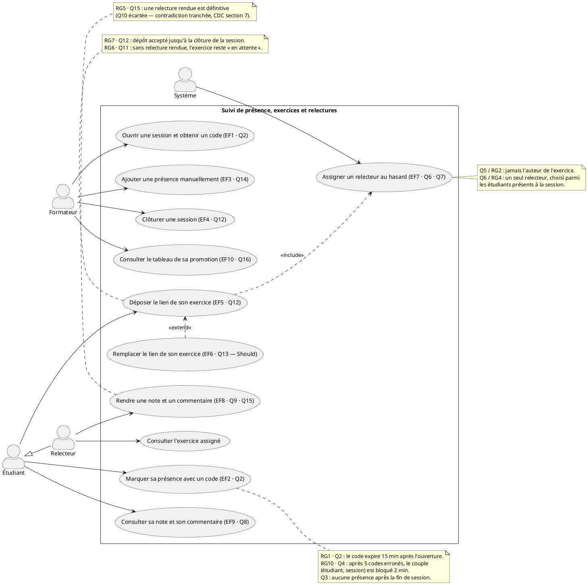

# D1 — Diagramme de cas d'utilisation

**Format :** PlantUML — le sujet autorise « Mermaid ou PlantUML, en texte ». Mermaid n'a
pas de notation « cas d'utilisation » ; PlantUML en propose une formelle (acteurs,
ellipses, `<<include>>`, `<<extend>>`, généralisation). Le source reste du texte pur,
versionné et diffusable en `diff`.

## Comment le lire

- **Acteurs** — le **Formateur** anime la session ; l'**Étudiant** y participe ; le
  **Relecteur** n'est pas un compte distinct : c'est un étudiant dans un rôle temporaire,
  pour un exercice donné (flèche de généralisation `Relecteur → Étudiant`, Q7).
- **Cas d'utilisation** — chaque ellipse est un objectif utilisateur vérifiable, relié aux
  exigences `EFx` du cahier des charges (traçabilité en bas de page).
- `<<include>>` — comportement systématiquement déclenché par le cas de base
  (déposer un exercice déclenche l'assignation d'un relecteur, EF7).
- `<<extend>>` — comportement conditionnel (remplacer le lien étend le dépôt, seulement
  tant que la relecture n'a pas commencé et que la session n'est pas clôturée, EF6/Q13).
- Le **Système** est un acteur secondaire : il agit sans intervention humaine quand le
  client le dit explicitement (Q7 : « Le système, au hasard »). Les règles purement
  automatiques (RG1, RG10) sont en notes, pas en cas d'utilisation : ce ne sont pas des
  objectifs utilisateur.

## Traçabilité cas d'utilisation → exigences

| Cas d'utilisation | Exigence | Sources client |
|---|---|---|
| Ouvrir une session et obtenir un code | EF1 | Q2 |
| Marquer sa présence avec un code | EF2 | Q2, Q3, Q4 |
| Ajouter une présence manuellement | EF3 | Q14 |
| Clôturer une session | EF4 | Q12 |
| Déposer le lien de son exercice | EF5 | Q12 |
| Remplacer le lien de son exercice (Should) | EF6 | Q13 |
| Assigner un relecteur au hasard | EF7 | Q6, Q7 |
| Rendre une note et un commentaire | EF8 | Q9, Q15 |
| Consulter sa note et son commentaire | EF9 | Q8 |
| Consulter le tableau de sa promotion | EF10 | Q11, Q16 |
