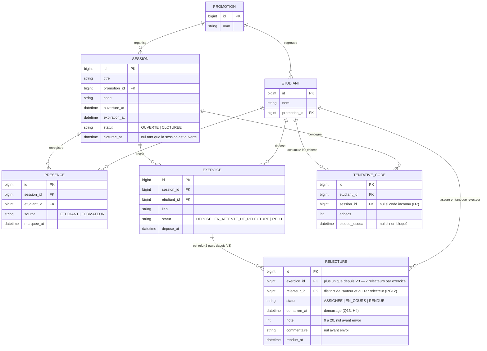

# D2 — Modèle de données

**Format :** Mermaid (`erDiagram`). Ce diagramme doit correspondre aux migrations :
toute évolution passera par une migration versionnée **et** une mise à jour de ce fichier.

## Entités et contraintes

| Entité | Contraintes principales |
|---|---|
| `promotion` | — |
| `etudiant` | `promotion_id` → promotion |
| `session` | `code` unique ; `statut` ∈ {OUVERTE, CLOTUREE} ; `cloturee_at` nul tant que la session est ouverte (H2, Q12) |
| `presence` | unique (`session_id`, `etudiant_id`) ; `source` ∈ {ETUDIANT, FORMATEUR} (RG9, Q14) |
| `exercice` | unique (`session_id`, `etudiant_id`) — un dépôt par étudiant et par session (409 imposé) ; statut ∈ {DEPOSE, EN_ATTENTE_DE_RELECTURE, RELU} |
| `relecture` | ~~unique (`exercice_id`) — un seul relecteur (Q6)~~ **depuis V3 : plusieurs lignes par exercice (2 relecteurs, enveloppe étape 3)** ; statut ∈ {ASSIGNEE, EN_COURS, RENDUE} ; `note` entière 0–20 (RG3) ; le relecteur n'est jamais l'auteur (RG2) ni déjà relecteur du même exercice (RG12) ; démarrer verrouille le lien (H4, Q13) |
| `tentative_code` | compteur RG10 par (`etudiant_id`, `session_id`) ; index uniques : (`etudiant_id`, `session_id`) quand la session est connue, (`etudiant_id`) quand elle ne l'est pas (H7, Q4) |

**Pas d'entité `formateur` ni `utilisateur`** : aucune opération du contrat n'identifie le
formateur (ni `formateurId`, ni authentification — Q1) ; il n'y a rien à stocker. Comptes
et promotions sont des **données préexistantes** (H1), injectées par migration de démonstration.

## Diagramme

## Correspondance avec les règles de gestion

| Règle | Où elle est garantie |
|---|---|
| Une présence par étudiant et par session | contrainte unique en base + service |
| Un seul relecteur par exercice (Q6) | ~~contrainte unique sur `relecture.exercice_id`~~ **Retiré en V3 (enveloppe étape 3) : un exercice porte désormais deux relectures** |
| Jamais relire son propre exercice (RG2) | service (règle inter-tables) |
| Note entière de 0 à 20 (RG3) | validation d'entrée + contrainte base |
| Un dépôt par étudiant et par session | contrainte unique en base + service |
| Verrouillage du lien au démarrage (Q13) | `relecture.statut = EN_COURS` + service |
