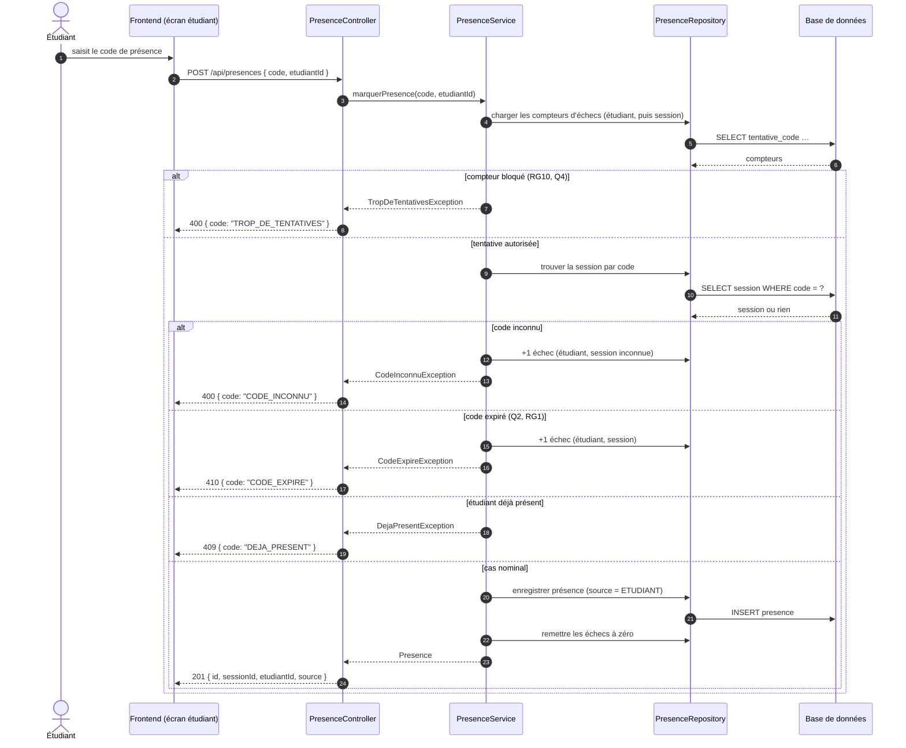

# D3 — Séquence : marquer sa présence

**Format :** Mermaid (`sequenceDiagram`). Correspondance exigée avec les codes HTTP du
contrat imposé : `201` (nominal) · `400 CODE_INCONNU` · `400 TROP_DE_TENTATIVES` (RG10) ·
`409 DEJA_PRESENT` · `410 CODE_EXPIRE`.

## Lecture du diagramme

- Le **blocage RG10** est vérifié avant tout enregistrement : d'abord le compteur de
  l'étudiant (échecs sur codes inconnus), puis le compteur du couple (étudiant, session)
  quand la session est identifiable. Au 5e échec, tout nouvel essai reçoit
  `400 TROP_DE_TENTATIVES` pendant deux minutes.
- `410 CODE_EXPIRE` traite Q2/RG1. La clôture de session **ne conditionne pas** la
  présence : décision H10 écartée, Q3 est couvert par RG1 (voir CDC section 7).
- L'ajout manuel par le formateur ne passe pas par ce flux : il utilise
  `POST /api/sessions/{id}/presences` (H3, Q14) et produit `source = FORMATEUR`.
- Les codes de statut et le format d'erreur sont ceux du contrat imposé ; seule la
  valeur métier `TROP_DE_TENTATIVES` est ajoutée dans le corps, comme prévu par RG10.
