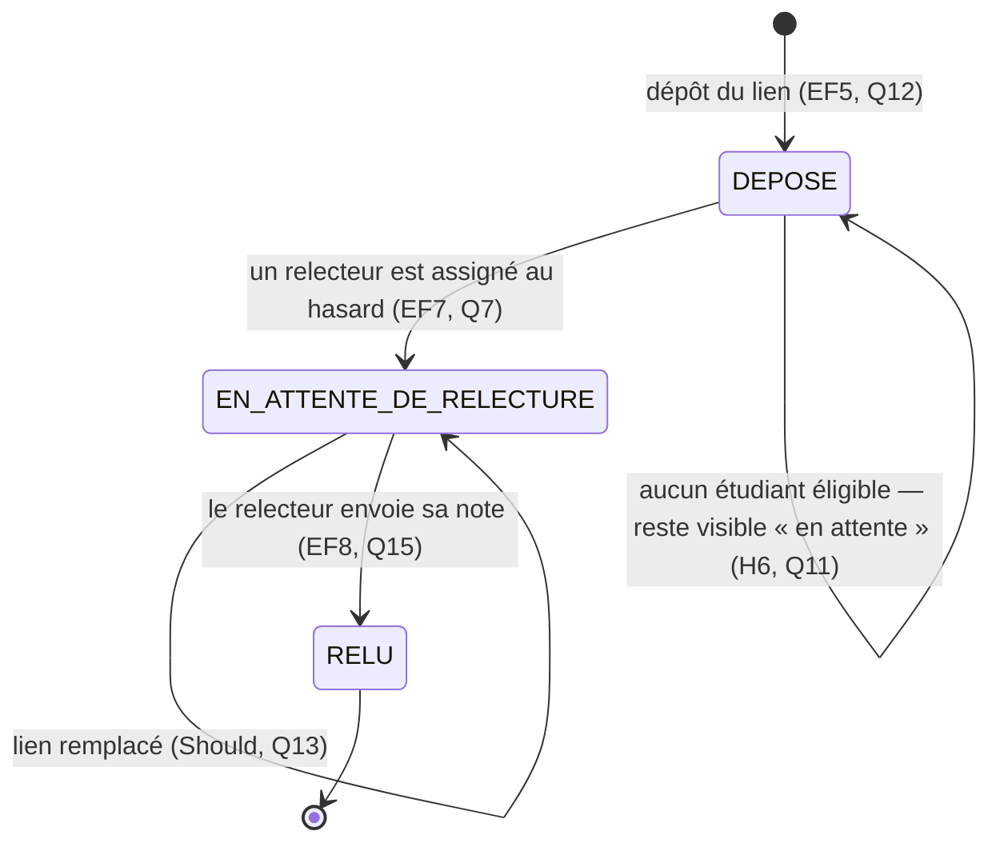
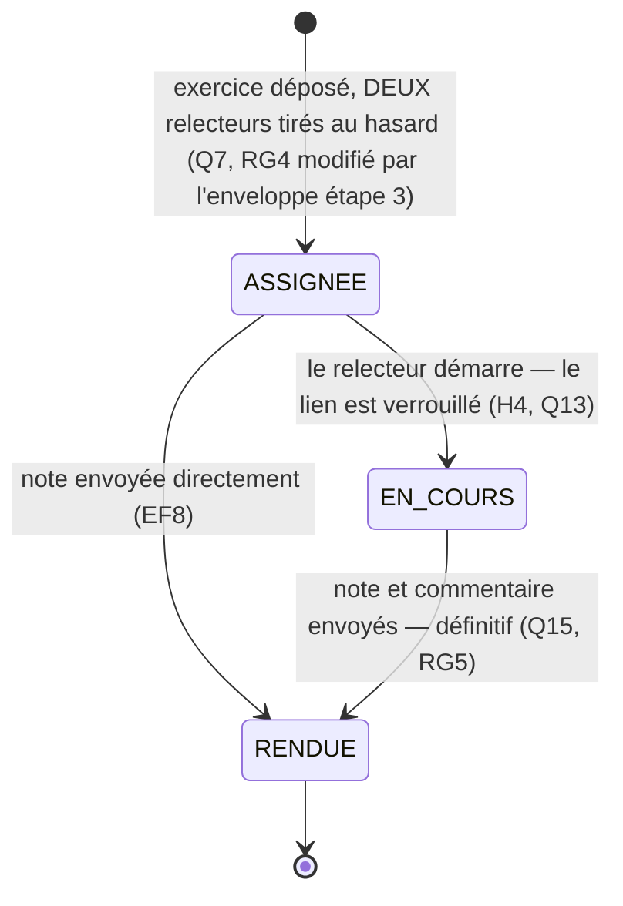

# D4 — États-transitions (bonus) : exercice et relecture

**Format :** Mermaid (`stateDiagram-v2`). Diagramme bonus (+3 points) : il complète D2
et documente Q13 (verrouillage du lien) et Q15 (note définitive).

## Cycle de vie d'un exercice (déposé → en attente de relecture → relu)

Notes :

- le remplacement du lien (Q13) ne change pas le statut mais reste borné : session non
  clôturée (RG7) **et** relecture ni commencée ni rendue (RG8) ;
- sans candidat relecteur (H6), l'exercice demeure `DEPOSE` — c'est le cas que le
  formateur doit voir « en attente » dans son suivi (Q11).

## Cycle de vie d'une relecture (supporte Q13)

Notes :

- un envoi après `RENDUE` est refusé : `409 RELECTURE_DEJA_RENDUE` (contrat imposé, Q15) ;
- un démarrage après `EN_COURS` est refusé : `409 RELECTURE_DEJA_COMMENCEE` (H4) ;
- `ASSIGNEE → RENDUE` est permis : un relecteur peut rendre directement sans démarrer.
- **Depuis la migration `V3` (enveloppe étape 3)**, cet automate existe **en double
  exemplaire par exercice** : deux pairs relisent le même dépôt. Chaque relecture suit
  le même cycle, indépendamment de l'autre.
- Tant que les deux notes ne sont pas rendues, la note affichée à l'étudiant est
  **provisoire** ; elle devient **définitive** — et égale à la moyenne des deux — quand
  les deux relectures sont `RENDUE`.
